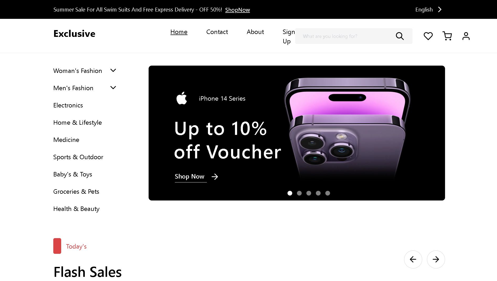

# Exclusive E-Commerce



A modern, full-stack e-commerce platform built with Next.js 14 and TypeScript. Features a complete shopping experience with authentication, cart management, order processing, and secure payment handling.

## Overview

Exclusive is a production-ready e-commerce solution featuring a responsive design, comprehensive security measures, and scalable architecture. The platform supports product catalog management, user authentication, shopping cart functionality, wishlist features, and complete order management with address book integration.

## Tech Stack

**Frontend**

- Next.js 14 (App Router)
- TypeScript
- Tailwind CSS
- React Hook Form + Zod

**Backend**

- Supabase (PostgreSQL + Auth)
- Next.js API Routes
- Row Level Security (RLS)

**State & Data**

- Zustand (State Management)
- React Query (Data Fetching)

## Key Features

- User authentication with session management
- Product catalog with categories and search
- Shopping cart with persistent storage
- Wishlist functionality
- Order management and history
- Address book management
- Form validation and error handling
- Rate limiting and security headers
- Responsive design

## Quick Start

```bash
# Install dependencies
npm install

# Set up environment variables
cp .env.local.example .env.local
# Add your Supabase credentials

# Set up database
# Run database/schema.sql in Supabase SQL Editor

# Start development server
npm run dev
```

Visit `http://localhost:3000` to view the application.

## Project Structure

```
├── app/              # Next.js pages & API routes
├── components/       # React components
├── hooks/           # Custom React hooks
├── lib/             # Utilities, types, validations
├── store/           # Zustand stores
└── database/        # SQL schemas
```

## Scripts

- `npm run dev` - Development server
- `npm run build` - Production build
- `npm start` - Production server
- `npm run lint` - Lint code

## Security

- SQL injection prevention
- XSS protection
- Price manipulation prevention
- Rate limiting on API endpoints
- Session management with auto-refresh
- Input validation and sanitization
- Security headers (HSTS, X-Frame-Options, etc.)

---

Built with modern web technologies and best practices.
